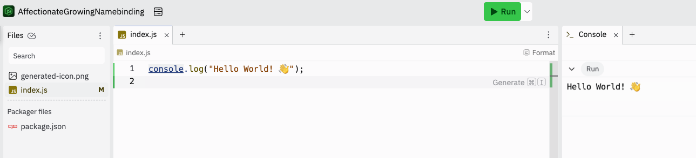

## Table of contents

1. [What is programming?](#what-is-programming?)
1. [Introduction to Javascript](#introduction-to-javascript)
1. [Goals](#goals)
1. [Resources needed](#resources-needed)
1. [Counting sheep](#counting-sheep)
1. [Hello world](#hello-world)
1. [Console.log](#console.log)
1. [Declare variables](#declare-variables)
1. [Assigning values](#assigning-values)
1. [Code comments](#code-comments)
1. [Arithmetic operators](#arithmetic-operators)
1. [Assignment operators](#assignment-operators)
1. [Additional resources](#additional-resources)

## What is programming?

La `programación` es un proceso mediante el cual, gracias a diversas herramientas y procesos, logramos comunicarnos con un ordenador. Por norma general esta comunicación pretende una traducción del lenguaje-persona (lenguaje) al lenguaje-máquina (código) en un conjunto de instrucciones paso-a-paso comprensibles para ambas partes (programa). El objetivo final es la transformación de una información inicial (inputs) a una información final (outpus).

> [!NOTE]  
> `Programación`: composición de instrucciones secuenciales (programas) que sigue un ordenador para ejecutar una tarea. Agrupa el diseño e implementación de algoritmos y/o procedimientos específicos step-by-step declarados a través de un lenguaje de programación.


Un ejemplo cotidiano de programación es la `cocina` como proceso con idéntica lógica interna:

- El `programa` es la receta completa
- El `código` son las instrucciones paso a paso (mezclar harina, agregar leche, batir, calentar la sartén, etc.)
- Las `variables` son los ingredientes, como la cantidad de harina, huevos, leche. Podemos modificarlas para ajustarlas al número de comensales
- Las `funciones` son acciones específicas que puedes reutilizar, como "batir los ingredientes" o "cocinar en el horno". En JavaScript podemos escribir algo así:

```js
// Declaración de la función
function recetaTortitas(harina, leche, huevos) {
	return `Mezcla de ${harina}g de harina, ${leche}ml de leche y ${huevos} huevos lista.`;
}

// Invocación de la función
console.log(recetaTortitas(200, 300, 2));
```

Cuando seguimos todas las instrucciones correctamente, obtenemos un plato terminado (el resultado del programa funcionando). Así funciona la programación en JavaScript: definimos instrucciones, usamos datos (ingredientes) y creamos algo útil (como una página web interactiva) 🚀.

## Introduction to Javascript

`JavaScript` es uno de los [lenguajes de programación más empleados](https://2020.stateofjs.com/en-us/demographics/) en el desarrollo web, móvil, juegos, etc. Abreviado comúnmente como JS se trata de un lenguaje de programación interpretado, dialecto del estándar ECMAScript. Se define como orientado a objetos,​ basado en prototipos, imperativo, débilmente tipado y dinámico.

¿Qué significa todo esto? ¡Pues muchas cosas! Pero no te preocupes. Esta es solo una definición estándar que iremos entendiendo poco a poco. Lo importante viene ahora.

Sobre JS hay mucho que leer y mucho que aprender, pero es ideal si estás empezando en el mundo de la programación por una sencilla razón: se trata de un `lenguaje de alto nivel`. Es decir, su sintaxis es muy similar a la que usamos las personas por lo que en muchas ocasiones tendrás la sensación de estar escribiendo comandos en inglés para comunicarte con tu ordenador.

JS es un lenguaje vivo y hay que estar al día para conocer las últimas tendencias y herramientas. Compartimos contigo dos de las muchas fuentes de información que veremos a lo largo del bootcamp: [stateofjs](https://2020.stateofjs.com/en-US/) y [ecma-international.org](https://www.ecma-international.org/publications-and-standards/standards/ecma-262/).

## Goals

Después de esta introducción serás capaz de:

- Entender el propósito del lenguaje JavaScript
- Declarar variables
- Componer expresiones lógicas

## Resources needed

- Crear una cuenta en https://repl.it/

## Counting sheep

Para esta introducción a JS podemos emplear la KATA [Counting sheep](https://www.codewars.com/kata/54edbc7200b811e956000556).

Una lista o `array` es una secuencia ordenada de datos. Estos datos pueden ser de x tipos. Por ejemplo, datos `BOOLEANS`(true o false).

Una `función` es una sintaxis que usamos para encapsular un programa (entran unos datos y salen otros datos). `function` es una palabra reservada de javascript.

`Variable`: contenedor de información.

Un `array` posee `propiedades` . Una de ellas es la propiedad length. Las listas o arrays cuentan sus elementos por posición (0,1,2...). En JS las listas están `indexadas desde 0`.

Un `blucle` es una instrucción bajo una sintaxis muy concreta que indica al programa que debe reptir x acción en cada interación. El número de interacciones también queda definido en la sintaxis de nuestro bucle.

Un dato importante es que, en JS, `comenzamos a contar desde 0`. Es decir, contamos posiciones no valores.

Sintaxis de `comentarios`:

```js
/* Comentario de bloque */
// Comentario de línea
```

Un bucle `for(condition){action}` posee 3 partes:

- Inicialización: Se ejecuta `sólo al inicio del bucle`.
- Condición: se ejecuta en cada iteración del bucle.
- Acción final: se ejecuta al finalizar el bucle.

- Se pone i en bucle `for` por iteración (es una convenicón).
- Todo lo que hay dentro de `{}` pertenece al bucle for.
- Todo lo que hay dentro de `[]` indica elemento de nuestro array.

```js
for (let i = 0; arrayOfSheep.length; i++) {
	// console.log(i)
}
```

`console.log()`: Instrucción de salida por consola.

`==` es un `operador de condición`.
`=` es un `operador de asignación` (de valor).

En javascript hay 7 tipos de datos primarios:

- string
- number
- boolean
- null
- undefined
- (...)

En javascript `la ejecución del código es secuencial`, línea por línea.

¡Respetar siempre!

- Poner ; al final de cada línea.
- Tabulación del código (identación).
- Espacios.
- [Otros](https://github.com/airbnb/javascript)

```js
let counter = 0;
function countSheep (arraySheep)
{
    for(let i = 0 (inicialización, instaciamos variable); i<= arraySheep.lenght (condición, se comprueba en cada bluque); i++ (acción que se ejecuta al acabar el bucle))
    {
        console.log(i);
        console.log(arrayShepp[i]);
        if(console.log(arrayShepp[i]) == true)
        {
            console.log(i, "OVEJA");
            counter ++;
        }
        else
        {
            console.log(i, "NO OVEJA")
        }
        return counter;
    }
    console.log("A POSTERIORI", i)
}
console.log("Tenemos un total de ",counter, " ovejas");

```

> [!TIP]
> Menos código no siginifica código más rápido. Existen maneras de compactar la gramática y formas de escritura que facilitan la lectura del código pero nada tiene que ver con los tiempos de ejecución.
>
> Diferencia entre `VAR` y `LET`: let te permite declarar variables limitando su alcance (scope) al bloque, declaración, o expresión donde se está usando. Lo anterior diferencia let de la palabra reservada var , la cual define una variable global o local en una función sin importar el ámbito del bloque.

## Hello world

Vamos a escribir nuestro primer código en JavaScript. En este código imprimimos por consola el texto "Hello World!".

```js
console.log('Hello World!');
```

Para probar el código, puedes acceder a la plataforma [repl.it](https://repl.it). Crea una cuenta y pega el código creando un nuevo `repl` usando el botón azul "+", selecciona el lenguaje `node.js`.

## Console.log

La función `console.log` indica al programa que debe imprimir un texto por consola, también llamada salida de programa. Dicha consola se puede encontrar en repl.it en la parte derecha con fondo negro.

La salida de consola es una interfaz de texto con el que podemos ver lo que está sucediendo en nuestro código. En él podemos ver por ejemplo, variables, texto, valores, expresiones, etc.

Más adelante trabajaremos con funciones, pero por el momento debes recordar algunas de las más importantes como lo es `console.log`. El funcionamiento es sencillo, a continuación del nombre de la función ponemos unos paréntesis `console.log(...)` que delimitarán la expresión que se va a imprimir por consola.

Dentro de los paréntesis hemos incluido el texto `"Hello World!"`. Como puedes comprobar, al escribir un texto en código JavaScript también debemos indicar los límites del mismo usando comillas dobles `"` o simples `'`.



> [!TIP]  
> Aunque no es estrictamente necesario, es una buena práctica terminar las líneas de código usando el delimitador `;`. ¡No lo olvides!

## Declare variables

Una `variable` es un contenedor de información. En lugar de usar continuamente valores, usamos las variables para almacenar información que posteriormente procesaremos. Por ejemplo, considera el siguiente ejemplo relacionado con un ticket de compra de un supermercado.

En este ejemplo mostramos diversos elementos en un ticket de compra. Tenemos un bono de compra del `20%` por lo que queremos calcular el descuento aplicado al total.

- Fruta y Verdura = 12€
- Lácteos = 16€
- Otros = 5€

Cálculo del total descontado:

```js
console.log((12 + 16 + 5) * 0.2);
```

El descuento es de `3.60 €`, no obstante, al escribir directamente los valores a calcular, si queremos imprimir por un lado el total descontado y por otro el descuento es más sencillo operar con una variable en lugar de repetir el cálculo.

```js
let total_articulos = 12 + 16 + 5;
let bono = 0.2;
console.log('Descuento', total_articulos * bono);
console.log('Precio a pagar', total_articulos - total_articulos * bono);
```

Como vemos en el ejemplo, acabamos de declarar dos variables usando la sintaxis `let`. Este es un detalle de cómo escribir la sintaxis que hemos usado en el ejemplo.

`let <nombre_variable> = <valor_inicial o expresión>;`.

Las variables nos permite guardar tanto un valor, como un resultado de una expresión o cálculo. En el ejemplo, `bono` guarda el valor `0.2` mientras que `total_articulos` guarda el resultado del cálculo `12 + 16 + 5`

JavaScript es un lenguaje `case sensitive`, es decir, que `totalarticulos` y `totalArticulos` se consideran dos variables diferentes. Eso se extiende a cualquier identificador en JavaScript.

> [!IMPORTANT]  
> Los nombres variables no deben contener espacios ni empezar con un número. Puedes comprobar si el nombre que quieres asignar a tu variable es válido usando esta herramienta: https://mothereff.in/js-variables

## Assigning values

En el siguiente ejemplo vamos a conocer el operador asignación `=`. Este operador asigna el valor o expresión en su parte derecha a una variable en la parte izquierda.

No es sintaxis correcta lo siguiente:

```js
// SyntaxError: Invalid left-hand side in assignment
5 = 10;
"hola" = 33;
```

> [!TIP]
> Es importante recordar que este operador no realiza una equivalencia como si ocurre en sintaxis matemática.

Veamos un ejemplo de sintaxis incorrecta:

```js
let precio_base = 1000;
let iva_porcentaje = 18;
console.log('Precio total', precio_base + (precio_base * 1) / iva_porcentaje);

let iva_porcentaje = 21;
console.log('Precio total', precio_base + (precio_base * 1) / iva_porcentaje);
```

Como vemos, la variable `iva_porcentaje` se declara con el valor inicial `18`. Posteriormente asignamos a la misma variable el valor `21`. Es un error común declarar variables por duplicado, por suerte JavaScript nos protege de dicho error lanzando el siguiente error.

`SyntaxError: Identifier 'iva_porcentaje' has already been declared`

En código funcional eliminamos la segunda declaración `let`:

```js
let precio_base = 1000;
let iva_porcentaje = 18;
console.log('Precio total', precio_base + (precio_base * 1) / iva_porcentaje);

iva_porcentaje = 21;
console.log('Precio total', precio_base + (precio_base * 1) / iva_porcentaje);
```

La variable `iva_porcentaje` cambia su valor durante la ejecución del código JavaScript. Debes comprender que dicho código se ejecuta línea a línea secuencialmente, una tras otra. Eso permite realizar un razonamiento lógico de como evoluciona el programa durante el tiempo de ejecución del mismo.

El contenedor o variable `iva_porcentaje` cambia su valor, es por ello que el valor impreso en consola mediante `console.log` es diferente, pese a que hemos usado la misma línea de código.

## Code comments

Es bastante común realizar anotaciones en nuestro código para recordar como realizamos ciertos cálculos. Para ello usamos la sintaxis de comentario de línea o bloque.

Línea:

```js
// Esto es un comentario de línea, no forma parte del código ejecutable
```

Bloque:

```js
/*
Esto es un comentario 
de bloque. Que puede
dividirse en varias líneas
sin necesidad de escribir //
en cada una de las mismas
*/
```

## Arithmetic operators

Los operadores aritméticos permiten realizar operaciones sobre números. Estos son los operadores disponibles en JavaScript:

| Operador | Descripción                      |
| -------- | -------------------------------- |
| +        | Suma                             |
| -        | Resta                            |
| \*       | Multiplicación                   |
| \*\*     | Exponenciación (a partir de ES6) |
| /        | División                         |
| %        | Módulo (Resto de división)       |
| ++       | incremento                       |
| --       | decremento                       |

## Assignment operators

Los operadores de asignación permiten asignar valores o expresiones a variables.

| Operador | Ejemplo     | Equivalencia   |
| -------- | ----------- | -------------- |
| =        | `x = y`     | `x = y`        |
| +=       | `x += y`    | `x = x + y`    |
| -=       | `x -= y`    | `x = x - y`    |
| \*=      | `x \*= y`   | `x = x \* y`   |
| /=       | `x /= y`    | `x = x / y`    |
| %=       | `x %= y`    | `x = x % y`    |
| \*\*=    | `x \*\*= y` | `x = x \*\* y` |

## Additional resources

- https://repl.it/
- https://developer.mozilla.org/ca/docs/Web/JavaScript
- https://es.wikipedia.org/wiki/JavaScript
- https://www.w3schools.com/js/js_syntax.asp
