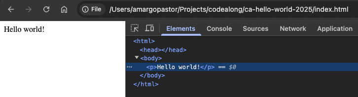
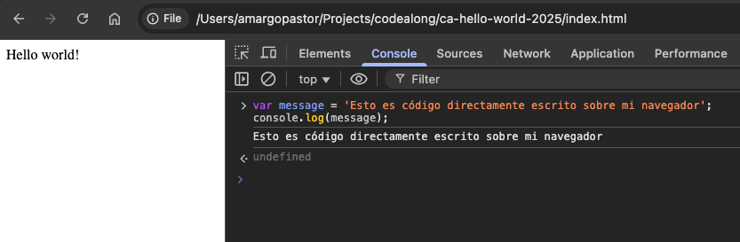
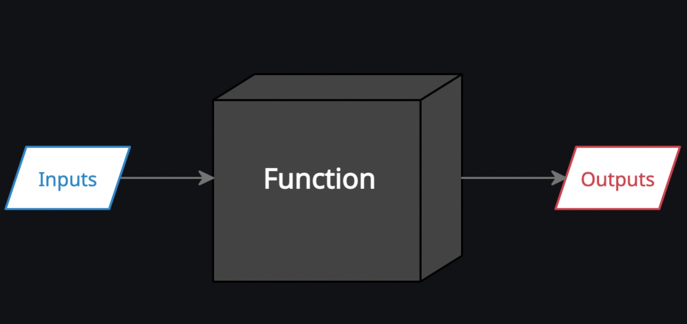

## Table of contents

1. [Basic Javascript](#basic-javascript)
1. [Goals](#goals)
1. [Resources needed](#resources-needed)
1. [Add JS](#add-js)
1. [Development tools](#development-tools)
1. [Variables](#Variables)
1. [Booleans if else](#booleans-if-else)
1. [Array](#Array)
1. [Functions](#Functions)
1. [Additional resources](#additional-resources)

## Basic Javascript

En esta unidad profundizaremos un poco más nuestro JavaScript, en los distintos tipos de variables que posee JavaScript, algunos ejemplos prácticos, métodos típicos y funciones. Además haremos una pequeña aproximación a la composición de un proyecto web con distintos archivos html css y js correctamente vinculados.

## Goals

Después de esta introducción serás capaz de:

- Entender mejor el lenguaje JS
- Vincular nuestro JS
- Herramientas del desarrollador
- Expresiones lógicas
- Introducción a funciones

## Resources needed

- Crear una cuenta en https://repl.it/

## Add JS

Añadir JS a tu archivo de trabajo es fundamental. Supongamos que vamos a ejecutar un archivo html en nuestro navegador (tan fácil como ir a la carpeta y hacer doble clic en el archivo index.html) que se acabará convirtiendo en nuestra primera página web. Existen muchas formas de incluir nuestro código JS en el mismo. Mira algunos ejemplos:

- Incluir JS directamente en HTML:

```html
<body>
	<script>
		console.log('hola mundo');
	</script>
</body>
```

- Vincular un archivo `script.js` en el header:

```html
<head>
	<meta charset="UTF-8" />
	<meta http-equiv="X-UA-Compatible" content="IE=edge" />
	<meta name="viewport" content="width=device-width, initial-scale=1.0" />
	<link rel="stylesheet" href="./style.css" />
	<script src="./script.js"></script>
	<title>Document</title>
</head>
```

- Vincular un archivo `script.js` justo antes del cierre del body:

```html
<body>
	<h1>Hello world</h1>
	<script src="./src/script.js"></script>
</body>
```

## Development tools

Uno de los primeros pasos que debemos dar como desarrolladores es aprender a usar las `Google chrome dev tools`. Todos los navegadores incluyen una serie de herramientas que nos permiten ver qué está pasando con nuestro JS. Recuerda que JavaScript se ejecuta en el lado del cliente de la web. Para acceder a las mismas abre un archivo index.html desde tu navegador Chrome y pulsa botón izquierdo del ratón sobre la pantalla y haz click en `inspeccionar`.



En el nuevo menú que se te desplegará verás mucha nueva información. Por ahora vamos sólo a detenernos en la pestaña de `Elements` (osbserva su información: ¿no te recuerda a tu archivo `index.html`?) y `Console`.

Es en Console dónde podremos ver los outputs de nuestro código e, incluso, escribir directamente más código JS. ¿Por qué? Porque la gran mayoría de los navegadores son capaces de entender el código JS y ejecutarlo.

Observa en el siguiente ejemplo cómo declaramos una variable y la ejecutamos:



## Variables

Una variable es un contenedor de información. Empleamos esta herramienta para almacenar cualquier dato sea cual sea tipo:

- `string`: También conocidas como cadenas de texto. Por ejemplo: `"Hello World"`
- `number`: Números enteror o con decimales. Por ejemplo `13`.
- `boolean`: Un tipo de dato interesante: solo admite valor `true`o `false`. Nada más.
- `array`: Una lista o array es una secuencia ordenada de datos. Estos datos pueden ser de x tipos. Por ejemplo, datos BOOLEANS(true o false).

Veamos en la práctica los distintos tipos de datos con el siguiente ejemplo. Copia y pega en tu replit.com, sobre tu archivo script.js correctamente vinculado o directamente sobre la consola de tu navegador. ¡Ahora ya conoces muchas formas de ejecutar tu código JS!

```js
// Variables de tipo number
let mi_masa = 70;
let Tierra = 1;
let Marte = 3.71;
let Jupiter = 23.12;

// Al tratarse de number podemos operar entre ellas directamente
console.log(mi_masa * Tierra);
console.log(mi_masa * Marte);
console.log(mi_masa * Jupiter);

// Variable de tipo string
let intro = 'Mi nombre es Marcos y en este planeta peso ';

//typeof nos devuelve el tipo de nuestra variable (string, number, boolena, array...)
console.log(typeof intro);

let data = mi_masa * Tierra;
console.log(typeof data);

console.log(intro + data);
```

## Booleans if else

En cualquier lenguaje de programación, el código necesita realizar decisiones y llevar a cabo diferentes acciones acordes dependiendo de distintas entradas. Por ejemplo, en un juego, si el número de vidas del jugador es 0, entonces se termina el juego. Para ello empleamos las declaraciones `if` y `else`.

Observa el siguiente ejemplo. Empleamos una nueva variable `oxígeno` que será del tipo boolean y la declaramos a `true`. El condicional preguntará a dicha variable su valor. Si este es true accederá a la información contenida en el if. En caso contrario, accederemos al else:

```js
let oxigeno = true;
console.log(typeof oxigeno);

if (oxigeno) {
	console.log('Puedo respirar!');
} else {
	console.log('Ayudagghghghg!');
}
```

## Array

Una lista o `array` es una secuencia ordenada de datos. Estos datos pueden ser de x tipos. El orden de los elementos en un array es importante. Los arrays son herramientas de gran utilidad en la programación y en JS traen consigo gran cantidad de métodos que nos permiten interactuar con ellos. Puedes echar un vistazo a la lista completa [aquí](https://developer.mozilla.org/es/docs/Web/JavaScript/Reference/Global_Objects/Array#). No te preocupes por entender esta información ahora mismo: ya habrá tiempo para ello más adelante.

Ahora vamos con un ejemplo sencillo de lo que es un array y cómo visualizar su información:

```js
// Podemos declarar un array de cualqueira de las dos siguientes formas:
let listado = [];
let listado2 = new Array();
console.log(typeof listado);
console.log(typeof listado2);

let listadoPlanetas = [
	'Mercurio',
	'Venus',
	'Tierra',
	'Marte',
	'Júpiter',
	'Saturno',
	'Urano',
	'Neptuno',
	'¿Plutón?',
];
console.log(typeof listadoPlanetas);

// Observa en acción el método .length: este devuelve la longitud de nuestro nuevo array:
console.log(listadoPlanetas.length);

// Con la sigueinte fórmula podemos acceder a un elemento concreto del array según su posición (IMPORTANTE: las posiciones de los elementos de un array empiezan a contar desde el cero):
console.log(listadoPlanetas[0]);
console.log(listadoPlanetas[2]);
```

## Functions

Una función es un bloque de código reutilizable. Podemos escribirle una única vez y utilizarlo cuantas veces sea necesario. De esa manera el programa resultante que escribamos es más fácil de entender, mantener y tenemos el tiempo de trabajo optimizado.

Dicho de otra manera: una función es una sintaxis que usamos para encapsular un programa dónde entran unos datos y salen otros datos. `function` es una palabra reservada de JavaScript que emplearemos para definirla:



Vamos con un nuevo ejemplo para verlo todo claramente. Analiza detenidamente las partes de la función, qué ocurre dentro y cómo se invoca a dicha función en la última línea:

```js
// Borramos el código anterior y volvemos a declarar un nuevo array de planetas:
let listadoPlanetas = [
	'Mercurio',
	'Venus',
	'Tierra',
	'Marte',
	'Júpiter',
	'Saturno',
	'Urano',
	'Neptuno',
	'¿Plutón?',
];

// Definimos una nueva función que recibirá un parámetro i y ejecutará un código y devolverá un output. Observa como empleamos la palabra reservada "function" seguida del nombre de la función (mi_reporte) seguida a su vez por los parámetros que le pasamos (una variable i que luego más adelante sustituiremos por cualquier número) y los tradicionales corchetes de apertura y cierre:
function mi_reporte(i) {
	console.log(i);
	console.log(
		'Mi nombre es Marcos y estoy de visita en el planeta',
		listadoPlanetas[i]
	);
}

// Llamada a la función declarada:
mi_reporte(5);

// ¿Qué resultado te devuelve?
```

## Additional resources

- [jsforcats](http://jsforcats.com/)
- [Métodos de los arrays](https://developer.mozilla.org/es/docs/Web/JavaScript/Reference/Global_Objects/Array#)
- [Ecma-international](https://www.ecma-international.org/)
- [stateJS](https://2020.stateofjs.com/en-US/)
- [brackets.io](http://brackets.io/)
- [atom.io](https://atom.io/)
- [sublimetext.com](http://www.sublimetext.com/)
- [visualstudio.com](https://code.visualstudio.com/Download)
- [lighttable](http://lighttable.com/)
- [checkVarNames](https://mothereff.in/js-variables)
