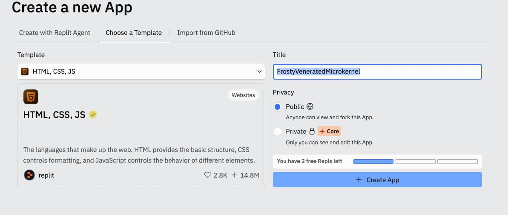

## Table of contents

1. [Introduction to HTML](#introduction-to-html)
1. [Goals](#goals)
1. [Resources needed](#resources-needed)
1. [Our first HTML](#our-first-html)
1. [Semantic HTML](#semantic-html)
1. [Block Vs Inline](#block-vs-inline)
1. [Block elements](#block-elements)
1. [Paragraphs](#paragraphs)
1. [Headings](#headings)
1. [Ordered lists](#ordered-lists)
1. [Unordered lists](#unordered-lists)
1. [Tables](#tables)
1. [Forms](#forms)
1. [Inline elements](#inline-elements)
1. [Strong](#strong)
1. [Link](#link)
1. [Break](#break)
1. [Images](#images)
1. [Script](#script)
1. [Additional resources](#additional-resources)

## Introduction to HTML

¿Qué es HTML?

`HyperText Markup Language (HTML)` es un lenguaje para la creación de páginas y aplicaciones web. HTML posee un conjunto de instrucciones especiales para la construcción en bloques de páginas web.

Una página web es una colección de distintos tipos de contenidos. Podemos encontrar textos, gráficos, formularios, audios y vídeos, etc. Estos elementos viven dentro de las etiquetas HTML. Nuestro navegador emplea estas etiquetas para decidir como mostrar, ordenar y dotar de estilos los componentes de la página.

Los archivos HTML que generan páginas web son simples archivos de texto. Estos text files son una representación universal de la información de nuestro ordenador. Cualquier HTML que crees en tu Windows se podrá trabajar en un MAC, Linux/Unix o cualquier otro sistema operativo.

La mejor manera de trabajar un archivo HTML es ponerse a ello directamente, así que vamos con un ejemplo real.

## Goals

Después de esta introducción serás capaz de:

- Entender la estructura de un fichero HTML, aplicar y usar etiquetas HTML y atributos para crear páginas
- Entender la diferencia entre elementos en línea y elementos bloque
- Crear una pequeña página con diferentes tipos de etiquetas HTML

## Resources needed

- Crear una cuenta en https://repl.it/

## Our first HTML

Emplearemos [replit.com](https://replit.com/) como herramienta para trabajar nuestros proyectos html, css y js. A continuación pega el siguiente fragmento de código html en tu `index.html`. Se trata simplemente de una página web con título, menú, imagen y algo de información.

Los navegadores web pueden leer y representar las etiquetas HTML. Este lenguaje de marcado (con un poco de ayuda del CSS) indica al navegador qué debe hacer con nuestro archivo.

```html
<!DOCTYPE html>
<html>
	<head>
		<title>The HTML5 Breakfast Site</title>
		<meta charset="UTF-8" />
	</head>
	<body>
		<div id="container">
			<nav id="topnav">
				<a href="index.html">HOME</a> | <a href="about.html">ABOUT US</a> |
				<a href="menu.html">MENU</a> |
				<a href="contact.html">CONTACT US</a>
			</nav>

			<section id="content">
				<h1>Breakfast Place</h1>
				<p>Here you will find all sorts of delicious treats</p>
				<figure>
					
					<figcaption>powered by brekkie.</figcaption>
				</figure>
			</section>

			<footer>
				<p class="love">Made with love</p>
			</footer>
		</div>
	</body>
</html>
```

Intenta localizar los siguientes componentes en el código HTML:

- Título de la página
- Barra de navegación: (HOME | ABOUT US | MENU | CONTACT US)
- La imagen del desayuno
- La firma de los creadores de la página

¿Los tienes todos?

## 2. HTML DOM tree

Todo documento de HTML puede ser representado como un árbol simbólico bajo el concepto de `Document Object Model`, popularmente conocido como `DOM`. Este DOM contiene todos los elementos que emplea el documento HTML, su formato y el estado del navegador en un momento concreto.

El DOM es una estructura usualmente representada como un árbol de nódulos, dónde podemos ver que nódulos contiene nuestro nódulo (por ejemplo un `<html>` que a su vez contiene los nódulos de `<head>` y `<body>`).

Dentro del DOM del HTML todo es un nódulo. Los elementos, atributos y contenido dentro de un elemento son nódulos. Pongamos el foco en el siguiente fragmento de código, por ejemplo:

```html
<!DOCTYPE html>
<html>
	<head>
		<title>My first document</title>
		<meta charset="UTF-8" />
	</head>
	<body>
		...
	</body>
</html>
```

### `<!DOCTYPE html>`

DOCTYPE indica que se empleará un lenguaje de marcado de tipo HTML5 en nuestro documento.

### `<html>`

Es el primer elemento de nuestro documento HTML. El resto de elementos están comprendidos en su interior y descienden de el. Se trataría de nuestro primer nodo. Es `obligatorio` cerrar esta etiqueta (o `tag`) con un `</html>`.

### `<head>`

Define el elemento que proveerá de cierta información específica (la metadata) a nuestro navegador, incluyen título, links a otras hojas de código, etc. Usualmente contiene:

### `<title>`

Define el título del documento. Solo existe un título en el head de nuestro HTML. Solo debe contener texto y se mostrará en la pestaña de nuestra página en el navegador.

### `<meta>`

Se emplea para declarar la metadata. Incluye información sobre estilos, scripts y otra información que ayuda al navegador a renderizar nuestra página. Uno de los elementos más comunes es `<meta charset="UTF-8">`. Ello especifica la codificación de los caracteres que emplearemos en el HTML. En este caso en concreto será UTF-8.

Por norma general, de cara al usuario esta información permanece "invisible" y no se mostrará en nuestro navegador.

### `<body>`

Es el elemento que agrupa todo el contenido de nuestro documento HTML. Debe estar siempre comprendido entre las etiquetas de `<body>` y `</body>`. Sólo puede haber un elemento body en todo el documento. Todos los elementos que incluyamos aquí se mostrarán en nuestra página en el navegador.

## Semantic HTML

`HTML semántico`: Uso de las etiquetas HTML para reforzar la semántica, o el significado, de la información en las páginas web más que simplemente redefinir su forma de presentación. Por ejemplo:

```html
<section></section>
<article></article>
<header></header>
<footer></footer>
```


## Block Vs Inline

Este es uno de los conceptos más importantes que veremos y es muy importante asimilar correctamente la diferencia entre `en bloque` y `en línea`, ya que nos ayudará a dominar la maquetación de nuestros sitios web.

Como hemos visto anteriormente, dentro del elemento `<body>` incluiremos todos los elementos que queremos mostrar en nuestra página web. Estos elementos pueden ser o elementos de bloque o elementos en línea. Veremos unos ejemplos a continuación.

## Block elements

Los elementos en bloque inician una nueva línea en nuestro sitio web y, si no establecemos su ancho, este se extiende todo el espacio disponible en la horizontal comprendida dentro del elemento padre contenedor. Un ejemplo de este tipo de elementos son los `<p>` y los `<div>`.

Veamos un ejemplo práctico en [replit.com](https://replit.com/):



En nuestra pestaña de HTML vamos a añadir un nuevo `<p>` para ampliar la información sobre nuestro desayuno. Puedes copiar y pegar el siguiente texto justo después del pequeño `<p>` que ya tenemos:

```html
<p>
	Our commitment is to use impeccable sourcing and quality ingredients to help
	you code. An ongoing collaboration between the classroom staff and the
	development team allow us to iterate our content and give our students the
	coding 'fruits and vegetables' -mainly made of JavaScript- that they need to
	grow as a healthy developer.
</p>
```

Fácil y rápido, ¿verdad?

## Paragraphs

Los elementos `<p>` representan un párrafo de texto. Estos son bloques de texto separados de otros elementos adyacentes por un espacio vertical en blanco y/o una indentación en la primera línea.

## Headings

Los headings, headers o textos de cabecera son títulos de hasta 6 niveles distintos. `<h1>` es el más importante y `<h6>` el de menor importancia. Un título que describe brevemente el tema de la sección que viene a continuación.

Puedes hacer la prueba en tu replit copiando las siguientes líneas y observando sus diferencias.

```html
<h1>Heading level 1</h1>
<h2>Heading level 2</h2>
<h3>Heading level 3</h3>
<h4>Heading level 4</h4>
<h5>Heading level 5</h5>
<h6>Heading level 6</h6>
```

## Ordered lists

El elemento HTML `<ol>` representa una lista ordenada. A cada elemento de la lista se le añade un número.

## Unordered lists

Los elementos `<ul>` representan items de una lista, pero su orden no es relevante y no queda indicado con numeración.

Un buen truco para saber cuál de estos dos elementos debemos usar es comprobar si el mensaje varía si cambiamos el orden de nuestros elementos. Además, ten en cuenta que no existe limitación en cuanto a número de elementos o profundidad que quieras darle a tus listas.

### Items in a list

Tanto `<ol>` como los `<ul>` poseen elementos internos que declararemos como `<li>`. Aquí un ejemplo para que lo veas más claro:

```html
<ol>
	<li>first item</li>
	<li>second item</li>
	<li>third item</li>
</ol>
```

Prueba a variar los elementos en tu replit y a crear otro modelo de lista sin ordenar.

## Tables

La etiqueta `<table>` se usa para representar información en una tabla de dos dimensiones. Requiere la ayuda de otros elementos para poder utilizarse.

Cada hilera de nuestra tabla la representaremos con un `<tr>`. Si dentro de la fila hay una cabecera usaremos un `<th>` (table header), en caso contrario emplearemos un `<td>` (table data).

Observa el siguiente ejemplo de una tabla completa:

```html
<table>
	<tr>
		<th>Name</th>
		<th>Hobbies</th>
		<th>Locality</th>
	</tr>
	<tr>
		<td>Marcos Íñigo</td>
		<td>Reading and video games</td>
		<td>Getafe</td>
	</tr>
	<tr>
		<td>Alexandra Sanz</td>
		<td>Sewing and walking in the countryside</td>
		<td>Getafe</td>
	</tr>
	<tr>
		<td>Miriam Sanz</td>
		<td>Photography and cinema</td>
		<td>Leganés</td>
	</tr>
</table>
```

## Forms

La etiqueta `<form>` nos permite preparar nuestra página para recibir elementos externos mediante inputs. El `<form>` contiene inputs, radio buttons, select boxes, etc. Usualmente emplearemos todos estos elementos para mandar información a nuestro servidor. Todo ello lo veremos más adelante gracias a JavaScript.

Por último también destacaremos dos elementos del formulario o atributos de gran importancia: `action` y `method`.

### Action

Este atributo establece la URL del programa que procesará la información de nuestro formulario. Dicho de otra manera, action indica al formulario a dónde debe enviar la información.

### Method

Este atributo establece el método HTTP que el navegador emplea para enviar la información. Los dos métodos más habituales son `get` y `post`. Por ahora no profundizaremos más en ellos, pero debes saber dónde se emplean y que cada uno tiene sus utilidades.

Vamos con un ejemplo sencillo de un formulario completo. Puedes pegarlo en tu replit para ver el resultado:

```html
<form action="" method="post">
	<label for="name">Name:</label>
	<input id="name" type="text" />
	<input type="submit" value="Save" />
</form>
```

### Fieldset

La etiqueta `<fieldset>` es un elemento que se emplea para agrupar varios elementos del formulario con sus respectivas etiquetas o `<label>`. Podemos agrupar elementos por diversas razones: estilos, organización, accesibilidad, etc.

Aquí un ejemplo de un fieldset y etiqueta:

```html
<form action="test.php" method="post">
	<fieldset>
		<input type="radio" id="radio" /> <label for="radio">Click me</label>
	</fieldset>
</form>
```

Ahora que conoces muchos más elementos HTML prueba tu mism@ a hacer distintas combinaciones de elementos. Crea tus propias tablas, menús y formularios en tu sitio web.

## Inline elements

Los elementos en línea se comportan como texto. Es decir, no inician una nueva línea y se muestran a continuación del elemento previo sin despejar el espacio previo. Veamos algunas nuevas etiquetas de HTML relativas a esta categoría:

### Emphasize text

Enfatizaremos una palabra "envolviéndola" con la etiqueta `<em>` y la etiqueta `<i>`:

```html
<p>
	... commitment is to use `<em>impeccable</em>` sourcing and `<i>quality</i>`
	ingredients... Modify the code on codepen to see the result.
</p>
```

Como habrás observado, el resultado visual es igual en ambos casos. ¿Cuándo usar una u otra?. Dependiendo del significado semántico que queramos darle. Acudamos a [MDN](https://developer.mozilla.org/es/) para apreciar correctamente la diferencia:

> An example for `<em>` could be: “Just do it already!”, or: “We had to do something about it”. A person or software reading the text would pronounce the words in italics with an emphasis.
>
> An example for `<i>`could be: “The Queen Mary sailed last night”. Here, there is no added emphasis or importance on the word “Queen Mary”. It is merely indicated that the object in question is not a queen named Mary, but a ship named Queen Mary . Another example for `<i>` could be: “The word the is an article”.

## Strong

Se emplea para dotar de importancia una parte del texto. Típicamente se mostrará en negrita.

## Link

La etiqueta `<a>` define un hipervínculo a una localización dentro de nuestra misma página o a otra página web. Normalmente va seguido del atributo ‘href’.

```html
<a href="http://www.example.com"></a>
```

## Break

El break o salto de línea (`<br>`) crea un "retorno de carro" o cambio de línea al siguiente elemento. Es de las pocas etiquetas que no tiene carácter de cierre.

## Images

`` define una imagen. Es seguida del atributo `src` que es obligatorio para poder añadir una imagen.

```html

```

## Script

La etiqueta `<script>` se emplea para incluir referencias a un script ejecutable en un archivo HTML.

## Recursos adicionales

- MDN HTML5 Documentation: https://developer.mozilla.org/en-US/docs/Web/Guide/HTML/HTML5
- html5doctor: http://html5doctor.com/
- Inline elements: https://developer.mozilla.org/en-US/docs/Web/HTML/Inline_elements
- Block-level elements: https://developer.mozilla.org/en-US/docs/Web/HTML/Block-level_elements
- HTML MDN Tutorial: https://developer.mozilla.org/en-US/docs/Learn/HTML
