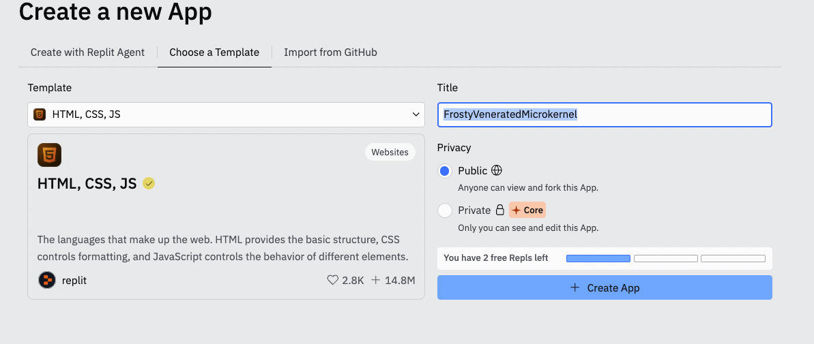
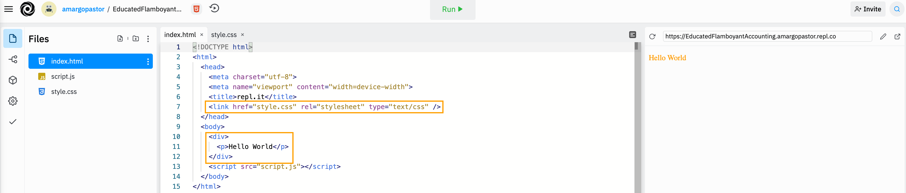
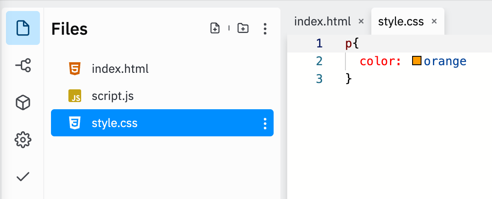
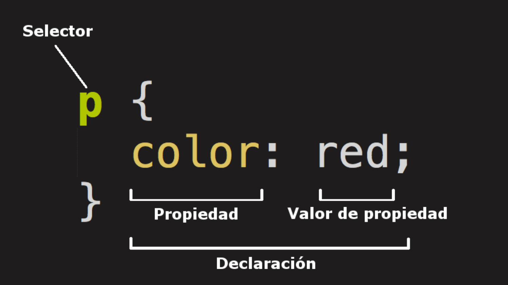
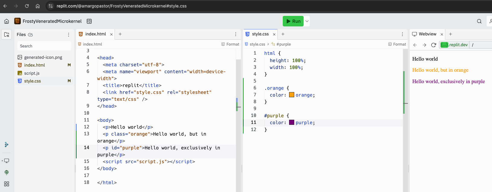
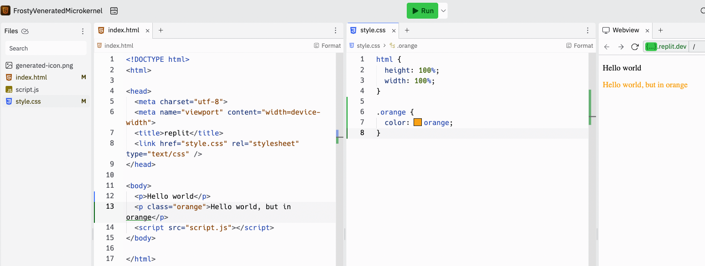
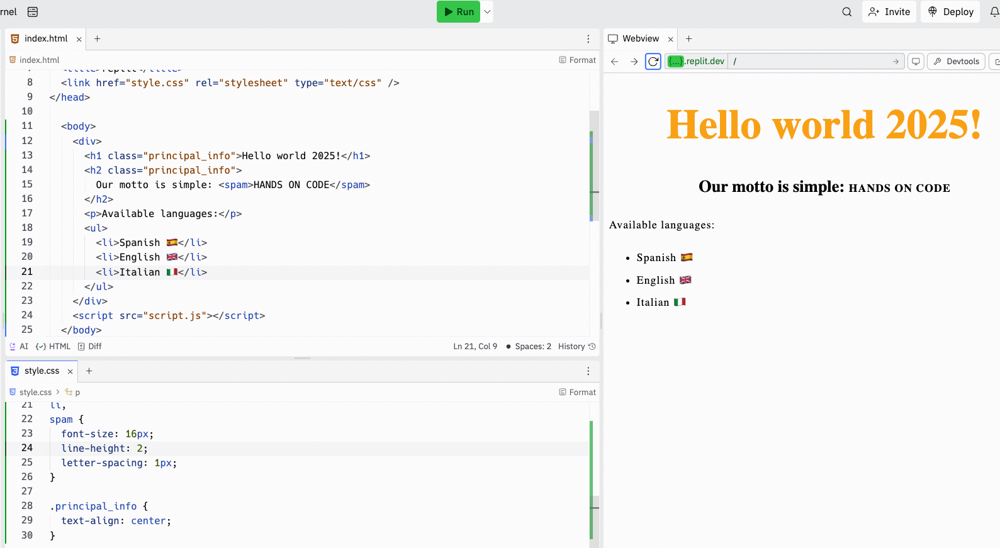
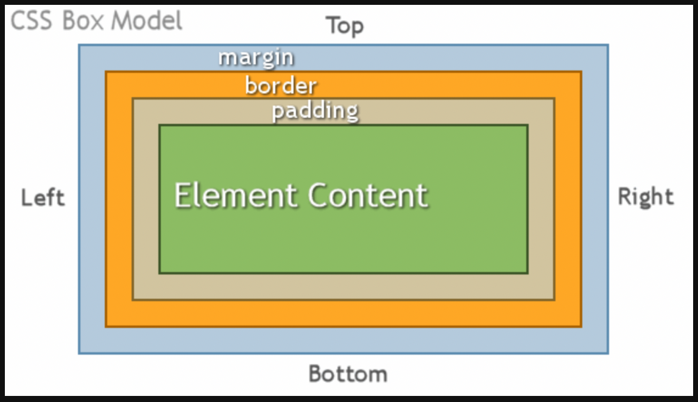

## Table of contents

1. [Introduction to CSS](#introduction-to-css)
1. [Goals](#goals)
1. [Resources needed](#resources-needed)
1. [CSS running](#css-running)
1. [Composition](#composition)
1. [Selectors](#selectors)
1. [Practical example](#practical-example)
1. [Its all about boxes](#its-all-about-boxes)
1. [Additional resources](#additional-resources)

## Introduction to CSS

CSS es un acrónimo de `C`ascading `S`tyle `S`heets u Hojas de Estilo en Cascada y este lenguaje tan particular se emplea para describir cómo debe ser renderizado un determinado elemento en la estructura de nuestro medio.

Es importante señalar que CSS no es un lenguaje de programación ni un lenguaje de marcado sino un `lenguaje de hojas de estilo`. Más concretamente nosotros trabajaremos CSS para dar estilos de manera selectiva a nuestros elementos HTML (alterar colores, posición, tamaños, animaciones, etc) que el navegador sepa interpretar.

## Goals

Después de esta introducción serás capaz de:

- Entender los conceptos básicos del CSS
- Tener una primera visión de las estructuras típicas de un HTML y un CSS
- La importancia de vincular correctamente los archivos de nuestros proyectos
- Los estilos más comunes que nos encontraremos en un archivo CSS

## Resources needed

- Crear una cuenta en https://repl.it/

## CSS running

Pongamos por ejemplo una estructura simple de nuestro `index.html`. Para ello puedes crearte un pequeño proyecto en tu Visual Studio Code que contenga una hoja de html y otra de css (como el que encontrarás en la carpeta de `resources` llamado `basic_html`), o acudir directamente a [replit.com](https://replit.com/) y crearte un nuevo archivo con formato HTML:



Una vez creado presta atención al formato de los archivos (html, css y js) y a la estructura básica de tu html. Al ejecutar nuestro código con el botón superior de RUN (o al abrir nuestro index.html desde VSC en el navegador) vemos como los estilos definidos en nuestro CSS sobre la etiqueta `<p>` afectan a la representación visual del archivo sobre el navegador:





En la primera imagen puedes ver cómo la hoja de estilos queda vinculada a nuestro HTML con la siguiente definición del head. Sin ella nuestro HTML no encontraría su CSS correspondiente y, por extensión, no aplicaría nuestros nuevos estilos:

```html
<link href="style.css" rel="stylesheet" type="text/css" />
```

## Composition

Las reglas que definimos en nuestro CSS siguen el siguiente formato:



### Selector

Elemento o etiqueta del HTML sobre el que aplicaremos nuestros estilos. Si queremos hacer referencia a otro elemento, definiremos una nueva regla. ¡Atención! A menos que especifiquemos (ver más adelante) estos estilos afectarán a **todos los elementos** que tengamos en el HTML que se llamen igual.

### Statement

Nuestra regla que especifica qué propiedad del elemento HTML quieres afectar con tus estilos.

### Property

Los elementos HTML poseen propiedades (cada uno las suyas propias). Bajo nuestra declaración seleccionamos cuál de todas ellas queremos afectar. Volviendo al ejemplo anterior, el elemento `<p>` posee una propiedad llamada `color` y sobre ella trabajaremos.

### Property value

Después de los 2 puntos elegimos el valor que daremos a la propiedad. La práctica y la documentación te irá dando una idea de que valores admiten cada una de las propiedades de un elemento. En el caso anterior determinamos que la propiedad `color` del elemento `<p>` tendrá un valor de `red`.

### Important notes

- Cada una de las reglas (aparte del selector) deben estar encapsuladas entre llaves `{}`.

- Dentro de cada declaración, debes usar los dos puntos `:` para separar la propiedad de su valor.

- Dentro de cada regla, debes usar el punto y coma `;` para separar una declaración de la siguiente.

## Selectores

Hasta ahora sólo conocemos un tipo de selector: los elementos del propio HTML. Como imaginarás, no es el único. Podemos hacer referencia al elemento sobre el que aplicar estilos de distintas maneras:

### ID or Identification Selector

Añadiendo una propiedad ID a nuestro elemento HTML podemos hacer referencia de manera exclusiva a dicho elemento. ¿Recuerdas cuando antes hemos dicho que un estilo sobre un selector genérico `<p>` afectaría a todos los elementos `<p>` de nuestro HTML? Pues con un ID evitaremos este problema:



Recuerda que los IDs deben ser siempre únicos (dos elementos distintos no pueden poseer mismo ID) y en nuestro CSS les haremos referencia a través de un `#`.

### class selector

Los selectores de clase siguen el mismo principio que los IDs, pero son un poco más flexible: varios elementos de nuestro HTML pueden compartir una misma clase.



En nuestro CSS haremos referencia a la clase mediante un `.` antes del nombre de la clase.

## Practical example

Vamos con un sencillo ejemplo para familiarizarnos con la estructura de nuestro HTML y CSS. Observa que añadimos nuevos elementos (h1, ul, li..). Cada uno de estos elementos tiene sus propiedades particulares:

```html
<body>
	<div>
		<h1 class="principal_info">Hello world 2025!</h1>
		<h2 class="principal_info">
			Our motto is simple: <spam>HANDS ON CODE</spam>
		</h2>
		<p>Available languages:</p>
		<ul>
			<li>Spanish 🇪🇸</li>
			<li>English 🇬🇧</li>
			<li>Italian 🇮🇹</li>
		</ul>
	</div>
	<script src="script.js"></script>
</body>
```

Y ahora viene el CSS. En este caso fíjate como es posible hacer referencia a varios selectores bajo una misma con una misma declaración:

```css
h1 {
	font-size: 60px;
	color: orange;
}

p,
li,
spam {
	font-size: 16px;
	line-height: 2;
	letter-spacing: 1px;
}

.principal_info {
	text-align: center;
}
```



## Its all about boxes

A medida que trabajes con tu hoja de estilos te irás dando cuenta de una cosa: CSS está basado en un `modelo de caja`. Cada caja ocupa un espacio determinado.

Estas cajas, relativas a los elementos en HTML, poseen varias propiedades:

- **Padding**: Al que nos referimos para hablar del espacio interior de un elemento entre sus bordes y su contenido.

- **Border**: La línea que delimita nuestro contenido y nuestro padding.

- **Margin**: Todo el espacio que se encuentra fuera de nuestro elemento y que lo separa del resto de componentes HTML.



Cuando trabajemos este concepto también nos encontraremos con elementos típicos como:

- **Width**: El ancho del elemento.

- **Background-color**: El color de fondo del contenido.

- **text-shadow**: Coloca una sombra difuminada en el texto dentro del elemento.

```css
body {
	width: 600px;
	margin: 0 auto;
	background-color: #ff9500;
	padding: 0 20px 20px 20px;
}

h1 {
	margin: 0;
	padding: 20px 0;
	color: #00539f;
	text-shadow: 3px 3px 1px black;
	border: 5px solid black;
}
```

- **Width: 600px**: Esto hará que el cuerpo siempre tenga 600 píxeles de ancho.

- **Margin: 0 auto**: Cuando seleccionas dos valores dentro de propiedades como margin o padding, el primer valor afectará los lados superior (top) e inferior (bottom), y el segundo valor los lados izquierdo (left) y derecho (right). Puedes usar esta propiedad con uno, dos, tres o cuatro valores como se explica en la [sintaxis de padding](https://developer.mozilla.org/es/docs/Web/CSS/padding#sintaxis).

- **Background-color: #FF9500**: Como antes, este selecciona el color de fondo de un elemento pero bajo un formato de [color hexadecimal](https://www.w3schools.com/colors/colors_hexadecimal.asp).

- **Padding: 0 20px 20px 20px**: Tienes 4 valores puestos en el relleno, para dar un poco de espacio alrededor del contenido. Esta vez no pondrás relleno en la parte de arriba de body, 20 píxeles a la izquierda, abajo y derecha. Los valores se ponen: arriba, derecha, abajo e izquierda, en ese orden. Como con margin usar esta propiedad con uno, dos, tres o cuatro valores como se explica en la [sintaxis de padding](https://developer.mozilla.org/es/docs/Web/CSS/padding#sintaxis).

- **Border: 5px solid black**: Este simplemente pone un borde de 5 píxeles de ancho, continuo y de color negro alrededor del elemento body.

> [!TIP]  
> Los selectores van de menos específicos (div) a más específicos (clase .button). Es decir, las clases tienen preferencia sobre las etiquetas.
> El orden de los estilos influye en el resultado final. Primero estilos generales de etiquetas. Después clases principales y luego variantes de clases y estilos concretos.

## Recursos adicionales

- https://www.w3.org/Style/CSS/#specs
- https://developer.mozilla.org/es/docs/Web/CSS
- https://www.w3schools.com/css/
