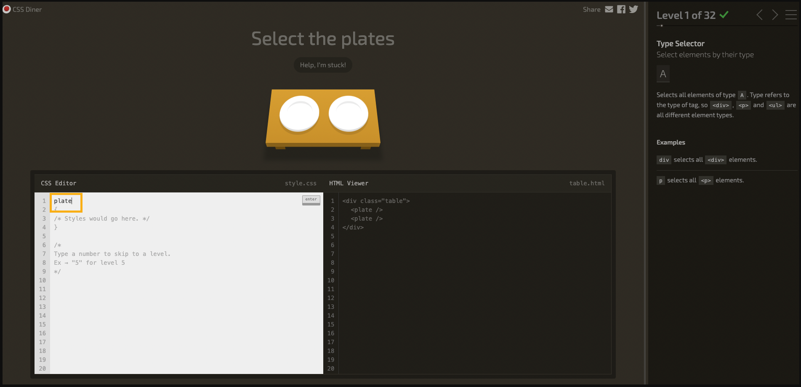

# CSS Selectors

Practica los selectores de CSS en [flukeout.github.io](https://flukeout.github.io/#). Para ello, lee atentamente las instrucciones de la parte derecha de la pantalla. Cuando finalices los 32 niveles, haz una captura de pantalla de tu progreso final y adjúntala en la próxima pull-request.

